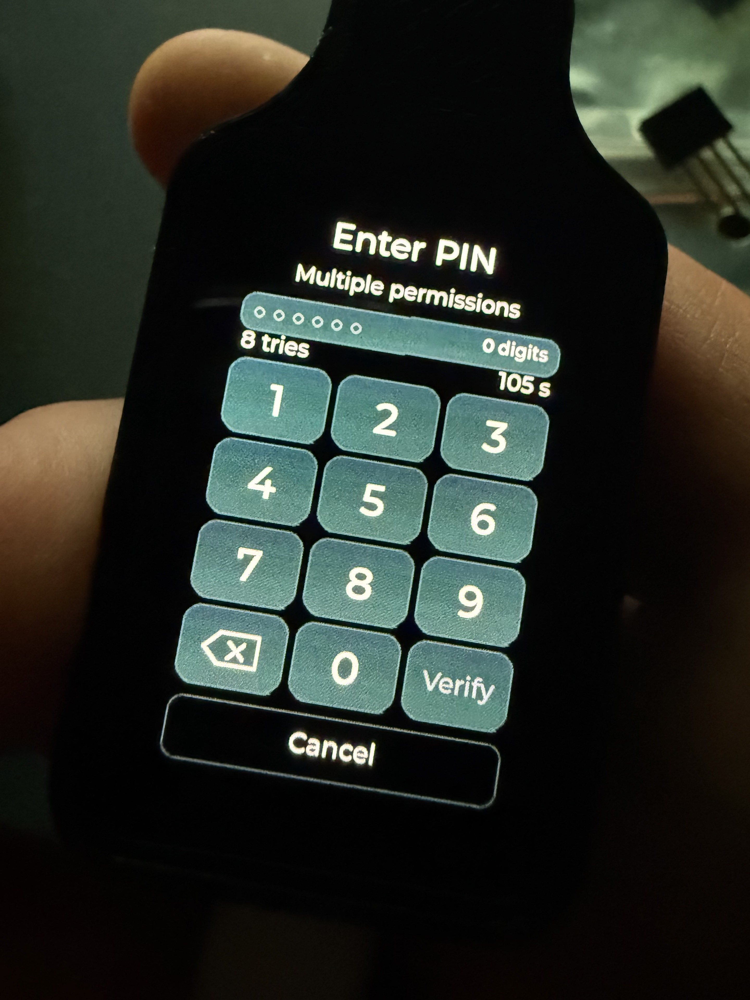

  

  <a href="https://github.com/mwr666/EvilKey-firmware">Firmware and device GUI</a> ·
  <a href="https://github.com/mwr666/EvilKey-Manager">Windows Manager</a> ·
  <strong>microSD examples</strong> ·
  <a href="https://hackaday.io/project/206807-evilkey-i-needed-a-fido2-key-then-the-maker-brain-took-over">Hackaday project</a> ·
  <a href="https://www.printables.com/model/1855790-evilkey-v1-enclosure-waveshare-esp32-s3-touch-amol">Printable V1 enclosure</a>

  

# EvilKey microSD examples

Original sample scripts for the EvilKey USB Tool. Copy the `microSD_EVILKEY_EXAMPLES/duckyscripts/` tree to the root of a microSD card and read each example's instructions before use. Some examples handle credentials or input events; run them only on systems you own or are explicitly authorized to test, and use synthetic data when learning or demonstrating them.

The firmware's separate **Apps** screen loads `.ekapp` bytecode from
`/evilkey/apps/`. These USB Tool scripts are a different format and this
repository contains no `.ekapp` package or application source. The
[firmware ABI v4 specification](https://github.com/mwr666/EvilKey-firmware/blob/main/apps/ABI_V4.md)
documents independent Apps packages.

ABI v4 can keep an app's state in a `<id>.save` file beside its `.ekapp` on
microSD. These sidecars belong to their individual apps. The USB Tool scripts
below neither install Apps nor contain game code, app bytecode or game saves.
Firmware 0.5.0 includes a microSD save fix. Its exact binary passed a device
smoke check; see the firmware repository for release availability.

**Start here:** [hello_world.duck](microSD_EVILKEY_EXAMPLES/duckyscripts/test/hello_world.duck) is a physically tested Windows demo. Select it in USB Tool and press **RUN** to open Notepad and type a harmless three-line joke. [Copy and test instructions](microSD_EVILKEY_EXAMPLES/README.md#tested-windows-demo).

[▶ Watch the USB Tool Short](https://youtube.com/shorts/k0a0o6s1Ayg)

USB Tool can send scripted keyboard and mouse input, save results on microSD and use Keystroke Reflection as a return channel when a mass-storage drive is unavailable. Scripts can move files or collect data within the host session's permissions and defenses. This Short shows the safe `hello_world.duck` HID test on the owner's Windows computer, **not** file transfer or data collection. The edit joins two real camera takes with captions and a logo outro. Nothing runs on connection: select a script on the key and press **RUN**.

## Watch Apps on the real device

[▶ Watch the Apps Short](https://youtube.com/shorts/e-bcwSlzdcg)

I needed a FIDO2 key. It now runs falling blocks and pinball. Apparently I was left unsupervised. This silent Short shows **EvilBlocks and EvilPinball on the real PCB V1 prototype**: select an app from microSD, press **RUN**, then play using the touchscreen. The captions and 3D logo/glitch outro are edited; the gameplay is filmed during development, rather than a benchmark of the latest app builds.

Apps are independent `.ekapp` packages in `/evilkey/apps/`, launched through **Settings → Apps** in the normal FIDO USB role. [Firmware 0.5.0 and its MIT SDK](https://github.com/mwr666/EvilKey-firmware/releases/tag/v0.5.0) provide ABI v4 with two touch contacts, accelerometer data, image assets and per-app microSD saves. Game packages have separate licenses and are not bundled in the public firmware, Manager or USB Tool examples repositories.

What app would you put on a device like this? Useful tools and gloriously unnecessary experiments are welcome.

These games use the Apps format, separate from the `.duck` USB Tool scripts supplied here.

## Hardware for the PCB V1 USB Tool demo

| Quantity | Component |
| --- | --- |
| 1 | Waveshare ESP32-S3 Touch AMOLED 1.64, **PCB V1** |
| 1 | Short data-capable USB-C cable/loop (Unitek C14179ABK-style in the prototype) |
| 1 | Printed V1 enclosure (the current prototype is home printed) |
| 4 | M2 × 5 mm screws for the module |
| 1 | M5 × 10 mm flat-point grub screw for the cable loop |
| 1 | **FAT32-formatted microSD card** for USB Tool scripts |

The microSD card is needed to reproduce `hello_world.duck`; FIDO2 and Air Mouse work without it. Copy this repository's `microSD_EVILKEY_EXAMPLES/duckyscripts/` tree to the card root; the tested script is `/duckyscripts/test/hello_world.duck`. Card capacity is not specified. See the [Hackaday component list](https://hackaday.io/project/206807/components) and [build instructions](https://hackaday.io/project/206807/instructions).

The separate Hak5 payload collection is not included. Four locally retained examples with third-party authorship or derivation notices are also excluded pending a separate rights review. See [package details](microSD_EVILKEY_EXAMPLES/README.md) and the [license](LICENSE.md).

## Real device GUI

[▶ Watch the real-device GUI Short](https://youtube.com/shorts/MK2NCrWpuXo) — silent footage of the touchscreen in use on the prototype, with an animated logo ending. The USB Tool script demonstration above is a separate video.

## Real Air Mouse demo

[▶ Watch the Air Mouse Short](https://youtube.com/shorts/b0x_XzGABB8) — the QMI8658 sensor steers a real computer cursor while **MOVE** is held; the touchscreen provides clicks and scrolling. This mouse-only USB role is separate from USB Tool, so the microSD scripts in this repository do not run in Air Mouse mode.

  

Real PCB V1 prototype with the FIDO2 PIN keypad on its touchscreen. This is a FIDO-role feature; microSD example scripts run only after USB Tool is selected and RUN is pressed.

## Related projects

- [EvilKey firmware](https://github.com/mwr666/EvilKey-firmware) — open AGPLv3 firmware and USB Tool implementation.
- [EvilKey Manager](https://github.com/mwr666/EvilKey-Manager) — Windows device controls and offline USB Tool data decoding under separate noncommercial terms.
- [Printable V1 enclosure](https://www.printables.com/model/1855790-evilkey-v1-enclosure-waveshare-esp32-s3-touch-amol) — digital STL and 3MF case files for the Waveshare PCB V1, sold separately on Printables.

I welcome ideas for clear, testable examples that demonstrate useful EvilKey behavior without relying on third-party payload collections.

Voluntary support is available through [GitHub Sponsors](https://github.com/sponsors/mwr666). Sponsorship is not a software purchase or a kit preorder.

## License

Original EvilKey examples are source available for private noncommercial use under [EvilKey microSD Examples License](LICENSE.md). Commercial use requires separate written permission from Michał Wojciechowski. Independently licensed material retains its own terms; the license does not cover outside script libraries.
